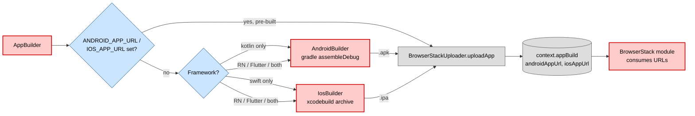
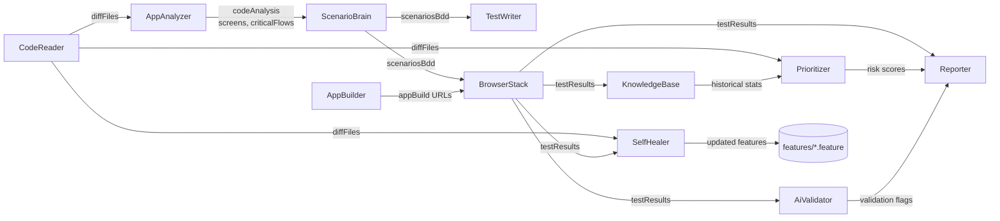

# Automated Testing Bot — End-to-End Flow

Visual reference for the full pipeline. For module-level details see [.claude/CLAUDE.md](.claude/CLAUDE.md) and [plan.md](plan.md). Diagrams are sourced from the actual orchestration in [src/index.ts](src/index.ts).

---

## 1. Main Pipeline

```mermaid
flowchart TD
    %% --- Trigger ---
    A([GitHub PR / workflow_dispatch]):::external --> B[/.github/workflows/test-bot.yml/]:::external
    B --> B1{{Detect framework job}}:::decision
    B1 -->|iOS detected| B2[macos-26 runner]:::external
    B1 -->|Android only| B3[ubuntu-latest runner]:::external
    B2 --> C[node dist/index.js PR_NUM]
    B3 --> C

    %% --- Critical core ---
    C --> M1[1. CodeReader<br/>diffFiles, framework hint]:::critical
    M1 --> D1{LOCAL_MODE?}:::decision
    D1 -->|yes| M3
    D1 -->|no| M2[2. AppBuilder<br/>build APK / IPA]:::critical

    M2 --> SUB[[App Build Sub-Pipeline<br/>see Section 2]]:::external
    SUB --> M3[3. AppAnalyzer<br/>screens, criticalFlows, apiEndpoints]:::critical
    M3 --> M4[4. ScenarioBrain<br/>BDD scenarios via Claude<br/>retry x3]:::critical
    M4 --> M5[5. TestWriter<br/>Gherkin → Appium step defs]:::critical

    M5 --> D2{appBuild URLs<br/>present?}:::decision
    D2 -->|no| M7
    D2 -->|yes| M6[6. BrowserStack<br/>execute on real devices<br/>retry x3]:::critical

    M6 --> D3{testResults<br/>has failures?}:::decision
    D3 -->|yes| M7[7. AiValidator<br/>false-positive detection]:::nonCritical
    D3 -->|no| M9
    M7 -.re-run minimal device set.-> M6
    M7 --> M8[8. SelfHealer<br/>heal locators, rewrite features]:::nonCritical
    M8 -.update feature files.-> M5

    %% --- Non-critical parallel-ish phase ---
    M8 --> M9[9. Accessibility]:::nonCritical
    M9 --> M10[10. Performance]:::nonCritical
    M10 --> M11[11. ApiTester<br/>retry]:::nonCritical
    M11 --> M12[12. Security<br/>MobSF + Nuclei]:::nonCritical
    M12 --> M13[13. VisualRegression<br/>Percy App SDK]:::nonCritical
    M13 --> M14[14. Chaos<br/>network + interrupts + monkey]:::nonCritical
    M14 --> M15[15. Prioritizer<br/>risk scoring]:::nonCritical
    M15 --> M16[16. KnowledgeBase<br/>store run, flaky detection]:::nonCritical
    M16 -.historical risk scores.-> M15

    %% --- Reporter ---
    M16 --> M17[17. Reporter<br/>PR comment, labels, check-run]:::critical
    M17 --> Z([GitHub PR updated]):::external

    %% --- Style classes ---
    classDef critical fill:#ffcccc,stroke:#cc0000,stroke-width:2px,color:#000;
    classDef nonCritical fill:#fff2b3,stroke:#b38600,stroke-width:1px,color:#000;
    classDef decision fill:#cce5ff,stroke:#004080,stroke-width:1px,color:#000;
    classDef external fill:#dddddd,stroke:#555,stroke-width:1px,color:#000;
```

---

## 2. App Build Sub-Pipeline

---

## 3. Data Flow Between Modules

---

## Legend

| Color  | Meaning                                                                 |
|--------|-------------------------------------------------------------------------|
| 🔴 Red    | **Critical** — failure aborts the pipeline (CodeReader, AppBuilder, AppAnalyzer, ScenarioBrain, TestWriter, BrowserStack, Reporter) |
| 🟡 Yellow | **Non-critical** — failure logs a warning, pipeline continues          |
| 🔵 Blue   | **Decision** — conditional branch (env flag, framework, result state)  |
| ⚪ Grey   | **External / IO** — GitHub, BrowserStack, file system, runners          |

Dashed edges = feedback loops (false-positive re-run, self-healer file rewrite, knowledge-base → prioritizer).
